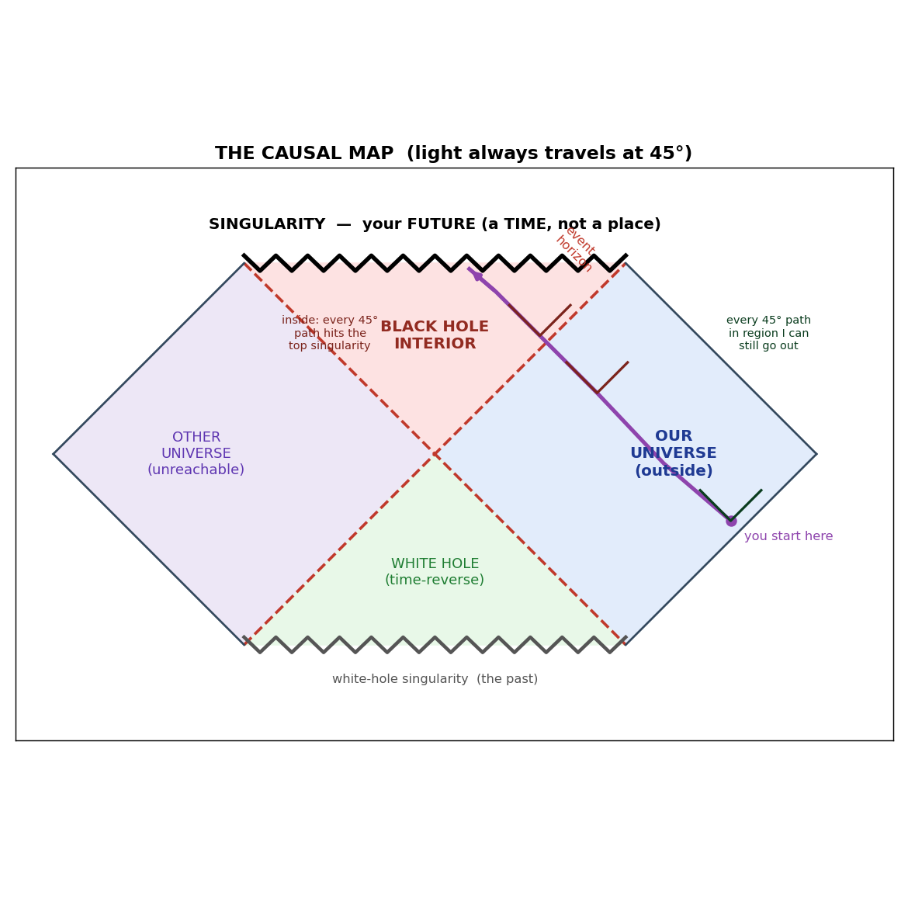

# DeepStrain

**Deep-learning searches of public LIGO/Virgo data for black-hole signatures.**

Three real-data gravitational-wave sub-projects — a **subsolar / primordial-black-hole merger search**, a **post-merger echo search**, and **ringdown spectroscopy** (a no-hair test) — plus the black-hole physics notes that started it all. Everything is measured on **real O3a/O4 detector noise**: sensitivity comes from injections, significance from a measured background, and **null results are treated as results.**

> A computer engineer's deep dive into gravitational-wave astronomy. Built carefully: every load-bearing claim is checked against the literature, every sensitivity number comes from injections into real noise, and a regression gate (`./verify.sh`, **36 checks**) asserts the headline results never silently change.

<p align="center"></p>

---

## The three searches

### 🛰️ `primordial_blackhole_search/` — subsolar-mass mergers
Below ~1 M☉ no star can collapse into a black hole, so a *subsolar* merger would be a smoking gun for **primordial black holes** (a dark-matter candidate). A CNN trigger on real O3a H1 noise reaches **41–45 % of the ideal matched-filter sensitive distance** at a zero-false-alarm threshold — for *minutes-long* signals, the regime with no published ML search.

- **Coincidence is the win.** Requiring H1×L1 agreement collapses the noise floor: **+1.37× sensitive distance** (~2.5× volume) over a single detector at matched FAR, and it stays robust **down to a 1/year false-alarm rate**. A *learned* coincidence statistic (256-d embeddings → a small head that asks whether the detectors *agree*) beats a plain sum by a further significant +0.02–0.05, leakage-free and bootstrap-verified.
- **The real matched-filter benchmark** — the question the whole project circled. A *realizable* semi-coherent dense-bank matched filter (1,619 templates at 0.1 % chirp-mass spacing, built + run on a laptop GPU) scores **0.489 vs the CNN's 0.472 on identical injections — a statistical tie.** A single CNN forward pass matches a 1,600-template bank. Both sit far below the true-template oracle (0.72), so **the dominant loss is template-bank mismatch, not learned-vs-matched-filter.** The fully-coherent ideal is genuinely intractable (megatemplate scale, consistent with LVK's real 3,452,006-template O4 subsolar bank).
- **Honest negatives that sharpened the picture:** score-aggregation across windows (two rungs); a learned semi-coherent classifier (caps ~0.70 AUC); and **Virgo** — a triple H1×L1×V1 coincidence *doesn't help* subsolar (V1 is too insensitive at these masses to carry signal).
- **Self-supervised pretraining** on unlabeled noise is a data-wall win: +0.28 sensitive-distance fraction at scarce labels.

### 🔔 `echoes/` — post-merger gravitational-wave echoes
If black-hole horizons have quantum structure, a merger might be followed by faint, repeating "echoes." A full pipeline (injection-calibrated, background-defined *p*-values) searches the post-ringdown of GW150914 / GW151012 / GW151226 / GW250114.

- A small ML noise-model scorer gives a **modest but real ~1.2× sensitivity edge** over the classical comb through the production path — band-honest, family-robust, periodicity-specific.
- The echo spacing is predicted **from first principles**: a Kerr-tortoise round-trip Δt(M,χ) that reproduces the Abedi Table-I values to <2 % (and caught a wrong hard-coded value in the repo).
- Every on-source event is a **clean null** under both the ML scorer and the comb, verified against an independent ±hour background. The novel angles — conditioning the echo search on the event's *own* ringdown mass, and stacking across events — are built and gated.

### 🌀 `ringdown_spectroscopy/` — black-hole spectroscopy / no-hair test
Fit the post-merger ringdown tones (quasinormal modes) and test whether they imply a *consistent* mass and spin — the no-hair theorem.

- An amortized simulation-based-inference (NPE) model with the ringdown **start-time marginalized by construction** measures the deviation δ **2.6× tighter than the classical fit**, calibration-certified (held-out coverage 0.91). On **GW250114** (the loudest event ever recorded): **δ = −0.16, consistent with a Kerr black hole.**
- **Cross-validated against the field-standard pipeline** (the Isi/Farr `ringdown` package): it independently detects the GW250114 overtone (A₂₂₁ bounded from zero) where our simplified machinery could not, and its (M, χ) posterior nests inside our NPE's — the first independent check of the whole SBI arc.
- A start-time sweep with that package **reproduces the early-time systematic** our NPE carries: peak-cropped fits are biased ~+10 % in mass, decaying as the start moves later.

---

## Headline numbers

| Search | Result | Status |
|---|---|---|
| Subsolar CNN (single detector) | 41–45 % of ideal-MF distance · 0 false alarms in 6.8 h real noise | ✓ gated |
| Subsolar H1×L1 coincidence | **+1.37×** sensitive distance, FAR-robust to 1/year; learned statistic beats sum | ✓ gated |
| Subsolar — **CNN vs real matched filter** | **tie** (0.489 vs 0.472 on identical injections); both bank-mismatch-limited | ✓ gated |
| Subsolar triple H1×L1×V1 | Virgo does **not** help at subsolar masses (honest negative) | ✓ gated |
| Echoes ML scorer | **~1.2×** over the classical comb; all on-source events null | ✓ gated |
| Ringdown no-hair | **σ(δ) 2.6× tighter**; GW250114 δ = −0.16, Kerr-consistent | ✓ gated |
| Ringdown overtone (field-standard) | GW250114 A₂₂₁ bounded from zero; NPE cross-validated | ✓ gated |

---

## 🔭 The event watcher — one command, the whole stack

```bash
python3 watch_event.py GW250114_082203
```

In ~48 s this runs all three sub-projects (across three Python environments) and emits a one-page report: the **ringdown remnant + overtone**, the **no-hair δ + Kerr consistency**, and the **echo Δt prediction + search p-value**. Because the no-hair NPE is *amortized*, it costs seconds per event — a standing instrument, ready to point at the next GW250114-class event from O4b/O5. (See [`watch_GW250114_082203.md`](watch_GW250114_082203.md) for the reference report.)

---

## Layout
```
primordial_blackhole_search/   subsolar/PBH merger search (CNN + coincidence + dense-bank MF)
echoes/                        post-merger echo search (comb + ML scorer)
ringdown_spectroscopy/         QNM fitting + SBI no-hair test + ringdown-package cross-check
watch_event.py  (root)         the event watcher — orchestrates all three into one report
*.md  (root)                   black-hole physics notes (holography, dimensions, paradox)
*.py  (root)                   figure generators (light cones, Penrose maps, …)
verify.sh                      regression gate over every headline artifact (36 checks)
dashboard.py                   live run monitor (stdlib HTTP, no deps)
```
Each sub-project is self-contained: `scripts/` (numbered steps + a shared lib), `notes/lab_notebook.md` (the raw record), `README.md` (methods + decisions), and its own `uv` virtual environment (pins in `requirements.txt`; the ringdown package pipeline needs Python 3.11 — `requirements-py311.txt`).

## Reproduce
Large, regenerable artifacts — raw LIGO strain, spectrogram shards, model weights, venvs — are **not** committed; only the code, docs, result records, and the segment `manifest.json` (so the exact GPS segments can be re-fetched from GWOSC).

```bash
cd <subproject> && uv venv && uv pip install -r requirements.txt   # per-project venv
.venv/bin/python scripts/01_*.py         # fetch data from GWOSC, then run the numbered pipeline
./verify.sh                              # from the root: 36 checks assert every headline result
```

**Docs:** [`ROADMAP.md`](ROADMAP.md) (next moves) · [`PLAN.md`](PLAN.md) (full backlog, done + parked) · [`JOURNAL.md`](JOURNAL.md) (dated log) · each sub-project's `notes/lab_notebook.md`.

## Ground rules (why you can trust the numbers)
- **Sensitivity from injections** into real noise — never assumed.
- **Significance from a measured background** — never a theoretical *p*-value.
- **Pre-registration** of each analysis before looking at on-source data.
- **Null results are results.** Several headline outcomes here are clean negatives, documented as carefully as the positives — including *why* they had to be negative.
- **Stress-test before believing.** The move that most often changed a conclusion was co-injecting on identical data, enlarging a small background, or refusing a false negative from an inadequate tool — each caught a would-be overclaim.

## Data & credits
Built entirely on public data from the [Gravitational Wave Open Science Center (GWOSC)](https://gwosc.org/), produced by the LIGO/Virgo/KAGRA collaborations (not affiliated). All SNRs are band-limited to [50, 1024] Hz; whitening is normalized so whitened-domain energy equals matched-filter SNR². Stack: Python · PyTorch · `gwpy` · `gwosc` · `pycbc` · `sbi` · the Isi/Farr `ringdown` package. If you use this work, see [`CITATION.cff`](CITATION.cff).
